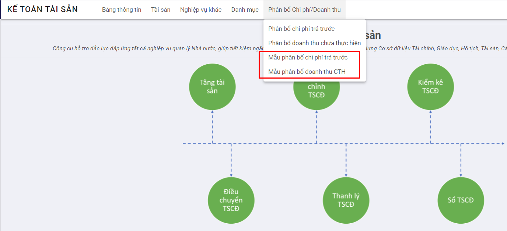
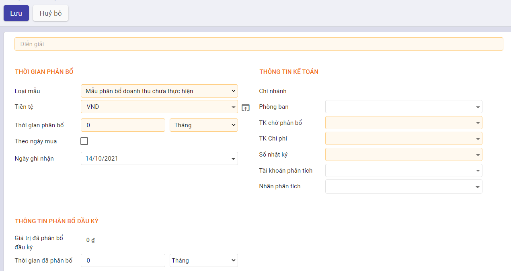

# HDSD Phân Bổ Chi Phí Trả Trước Và Doanh Thu Chưa Thực Hiện

## Phân Bổ Chi Phí Trả Trước

### Mục đích:

Cho phép kế toán thực hiện phân bổ chi phí trả trước để ghi nhận chi phí theo từng kỳ

### Quy trình nghiệp vụ:

**Các luồng quy trình:**

+ Phân bổ Chi Phí trả trước. Chi tiết xem **[Tại đây](### Phân bổ Chi phí trả trước)**
+ Điều chỉnh Tăng giá trị/thời gian. Chi tiết xem**[Tại đây](###Điều chỉnh Tăng giá trị/ thời gian phân bổ)**
+ Điều chỉnh Giảm giá trị/thời gian. Chi tiết xem **[Tại đây](### Điều chỉnh Giảm giá trị/thời gian phân bổ)**

### Phân bổ Chi phí trả trước

**Mô tả:**

Doanh nghiệp thực hiện phân bổ chi phí trả trước cho từng phòng ban, đối tượng theo từng kỳ

**Đối tượng thực hiện:** Nhân viên Kế toán

**Các thao tác thực hiện:** 

**Bước 1:** Vào chức năng **Kế toán Tài sản** -> Chọn **Phân bổ Chi phí/Doanh thu** -> Chọn **Phân bổ Chi phí trả trước**-> Nhấn nút **Tạo**

**Bước 2:** Người dùng thực hiện khai báo thông tin tại tab Thông tin chung và các tab khác

+ Nhập nội dung phân bổ 

+ Giá trị phân bổ được xác định từ: 

  - Nhập tay 
  - Chọn từ Chứng từ liên quan -> giá trị phân bổ không được sửa 
  - Tự động sinh từ luồng mua hàng -> giá trị phân bổ không được sửa

+ Thông tin về thời gian phân bổ, ngày ghi nhận phân bổ; các thông tin liên quan đến tài khoản chờ phân bổ, tài khoản chi phí, sổ nhật ký để ghi nhận các bút toán liên quan

+ Nếu đã phân bổ chi phí trước khi sử dụng phần mềm -> Người dùng thực hiện khai báo Giá trị đã phân bổ và thời gian đã phân bổ đầu kỳ tại mục *Thông tin phân bổ đầu kỳ*

+ Trường hợp người dùng chọn Tính phân bổ chi tiết theo đối tượng -> Thực hiện điền thông tin đối tượng phân bổ tại tab *Thiết lập phân bổ* -> Hệ thống ghi nhận bút toán phân bổ cho từng đối tượng tương ứng với đầu tài khoản chi phí và tỷ lệ phân bổ đã khai báo

  

+ Trường hợp người dùng chọn các chứng từ liên quan tới việc Phân bổ chi phí trả trước -> Chi tiết chứng từ được ghi nhận tại tab Nguồn gốc hình thành. Tài khoản của chứng từ sẽ ghi nhận thành Tài khoản chờ phân bổ

  

**Bước 3:** Nhấn nút Tính phân bổ để tính phân bổ chi phí trả trước -> Giá trị phân bổ theo từng kỳ sẽ được ghi nhận tại tab *Phân bổ ước tính*

#### **Quản lý thông tin phân bổ**

*Giá trị phân bổ chi phí trả trước sẽ được tính theo Phương pháp đường thẳng*.  Kết quả phụ thuộc vào các yếu tố dưới đây:

- [x] Người dùng có chọn *Tính phân bổ theo ngày thực tế hay không*
- [x] Phân bố chi phí đã được thực hiện ngoài phần mềm hay chưa
- [x] Có tick *Theo ngày mua hay không*

+ Nếu không tính theo ngày thực tế -> Hệ thống thực hiện tính phân bổ 1 tháng = 30 ngày, ngược lại sẽ tính theo ngày thực tế của tháng

- Bản ghi phân bổ chi phí trả trước có tick *Theo ngày mua* -> Giá trị phân bổ sẽ được tính từ ngày theo ngày mua

- Bản ghi phân bổ không tick *Theo ngày mua* -> Giá trị phân bổ  sẽ được tính từ *Ngày mua*

- Trường hợp Chi phí đã được phân bổ 1 phần trước khi khai báo trên phần mềm-> Hệ thống thực hiện trừ Giá trị tiền đã phân bổ và Số ngày đã phân bổ ngoài phần mềm để tính ra giá trị phân bổ cho từng kỳ

  - Căn cứ vào Tổng số ngày khấu hao, Giá trị khấu hao và Tính khấu hao theo ngày thực tế hay không -> Hệ thống thực hiện tính ra giá trị khấu hao cho 1 ngày

  - Từ giá trị khấu hao 1 ngày -> Tính ra giá trị khấu hao cho 1 tháng hoặc 1 năm

  - Khi người dùng nhấn nút **Xác nhận**, hệ thống sẽ ghi nhận bút toán và cập nhật lại số liệu liên quan đến Giá trị tiền tại tab thông tin chung:

    - Bút toán ghi nhận theo từng kỳ khấu hao
      - Ghi có Tài khoản chờ phân bổ
      - Ghi nợ Tài khoản chi phí ( đối với bản ghi có thiết lập phân bổ cho đối tượng -> Ghi nợ tài khoản chi phí ứng với từng đối tượng )

    - Giá trị tiền tại Tab Thông tin chung
      - Số tiền đã phân bổ tính dựa trên bút toán đã hạch toán và số tiền đã phân bổ ngoài phần mềm
      - Giá trị sổ sách = Nguyên giá - Số tiền đã phân bổ

### Điều chỉnh Tăng giá trị/ thời gian phân bổ

**Mô tả:**

Khi doanh nghiệp có nhu cầu Tăng giá trị/ thời gian phân bổ, hệ thống sẽ cập nhật thay đổi và tính toán lại giá trị phân bổ đối với từng kỳ

**Các bước thực hiện:**

**Bước 1:** Vào chức năng **Kế toán Tài sản** -> Chọn **Phân bổ Chi phí/Doanh thu** -> Chọn **Phân bổ chi phí trả trước** -> Chọn bản ghi phân bổ muốn điều chỉnh Tăng

**Bước 2:** Nhấn nút **Điều chỉnh phân bổ**

**Bước 3:** Người dùng thực hiện nhập liệu liên quan đến

- Lý do điều chỉnh
- Ngày điều chỉnh -> Hệ thống ghi nhận thay đổi từ ngày này
- Giá trị sau điều chỉnh
  - Nếu muốn tăng giá trị phân bổ -> Nhập giá trị còn lại mới > giá trị còn lại cũ
  - Nếu muốn tăng thời gian phân bổ -> Nhập thời gian phân bổ mới > thời gian phân bổ cũ

- Thông tin các đầu Tài khoản ghi nhận thay đổi tại mục *Thông tin Kế toán*

**Bước 4:** Nhấn nút *Điều chỉnh*

- Đối với bản ghi điều chỉnh thỏa mãn điều kiện sẽ ghi nhận giá trị Tăng  vào trường **Tổng giá trị tăng** tại tab Thông tin chung và tác động đến *Phân bổ ước tính* và *Sinh bút toán ghi nhận Tăng* *giá trị phân bổ tương ứng* như sau:

  - Tab phân bổ ước tính
    - Giá trị phân bổ được tính lại từ ngày điều chỉnh trên popup Điều chỉnh phân bổ
    - Các bút toán phân bổ trước ngày điều chỉnh vẫn được giữ nguyên theo giá trị chưa ghi nhận Tăng

  - Bút toán ghi nhận Tăng giá trị
    - Ghi nợ Tài khoản tăng tổng chi phí
    - Ghi có Tài khoản đối ứng

### Điều chỉnh Giảm giá trị/thời gian phân bổ

**Mô tả:**

Khi doanh nghiệp có nhu cầu Giảm giá trị/ thời gian phân bổ chi phí trả trước, hệ thống cập nhật thay đổi và tính toán lại giá trị phân bổ theo từng kỳ

**Các bước thực hiện:**

**Bước 1:** Vào chức năng **Kế toán Tài sản** -> Chọn **Phân bổ Chi phí/Doanh thu** -> Chọn **Phân bổ chi phí trả trước** -> Chọn bản ghi phân bổ muốn điều chỉnh Giảm

**Bước 2:** Nhấn nút **Điều chỉnh phân bổ**

**Bước 3:** Người dùng thực hiện nhập liệu liên quan đến

- Lý do điều chỉnh
- Ngày điều chỉnh -> Hệ thống ghi nhận thay đổi từ ngày này
- Giá trị sau điều chỉnh
  - Nếu muốn giảm giá trị phân bổ -> Nhập giá trị còn lại mới < giá trị còn lại cũ
  - Nếu muốn tăng thời gian phân bổ -> Nhập thời gian phân bổ mới < thời gian phân bổ cũ

- Thông tin các đầu Tài khoản ghi nhận thay đổi tại mục *Thông tin Kế toán*

**Bước 4:** Nhấn nút *Điều chỉnh*

- Đối với bản ghi điều chỉnh thỏa mãn điều kiện -> Hệ thống sẽ ghi nhận giảm giá trị phân bổ tại tab Thông tin chung và tác động đến *Phân bổ ước tính* và *Sinh bút toán ghi nhận Giảm* *giá trị phân bổ tương ứng* như sau:

  - Tab phân bổ ước tính
    - Giá trị phân bổ được tính lại từ ngày điều chỉnh trên popup Điều chỉnh phân bổ
    - Các bút toán phân bổ trước ngày điều chỉnh vẫn được giữ nguyên theo giá trị chưa ghi nhận Giảm

  - Bút toán ghi nhận Giảm giá trị
    - Ghi nợ Tài khoản chi phí
    - Ghi có Tài khoản phân bổ

## Phân bổ doanh thu chưa thực hiện

### Mục đích:

Cho phép kế toán phân bổ doanh thu nhận trước nhưng chưa tính vào doanh thu bán hàng trong kỳ như các khoản thu tiền trước cho thuê tài sản trong kỳ, thu trước tiền dịch vụ…

### Quy trình nghiệp vụ:

**Các luồng quy trình:**

+ Phân bổ Doanh thu chưa thực hiện. Chi tiết xem **[Tại đây](###Phân bổ Doanh thu chưa thực hiện)**
+ Điều chỉnh Tăng giá trị/thời gian. Chi tiết xem **[Tại đây](### Điều chỉnh Tăng giá trị/ thời gian phân bổ)**
+ Điều chỉnh Giảm giá trị/thời gian. Chi tiết xem **[Tại đây](### Điều chỉnh Giảm giá trị/thời gian phân bổ)**

### Phân bổ Doanh thu chưa thực hiện

**Mô tả:** Doanh nghiệp thực hiện phân bổ doanh thu được trả trước cho từng phòng ban, đối tượng theo từng kỳ

**Đối tượng thực hiện:** Nhân viên Kế toán

**Các thao tác thực hiện:** 

**Bước 1:** Vào chức năng **Kế toán Tài sản** -> Chọn **Phân bổ Chi phí/Doanh thu** -> Chọn **Phân bổ Doanh thu chưa thực hiện**-> Nhấn nút **Tạo**

**Bước 2:** Người dùng thực hiện khai báo thông tin tại tab Thông tin chung và các tab khác

+ Nhập nội dung phân bổ 

+ Giá trị phân bổ được xác định từ: 

  - Nhập tay 
  - Chọn từ Chứng từ liên quan -> giá trị phân bổ không được sửa 
  - Tự động sinh từ hóa đơn bán hàng -> giá trị phân bổ không được sửa

+ Thông tin về thời gian phân bổ, ngày ghi nhận phân bổ; các thông tin liên quan đến tài khoản Doanh thu chưa thực hiện, tài khoản doanh thu, sổ nhật ký để ghi nhận các bút toán liên quan

+ Nếu đã phân bổ doanh thu trước khi sử dụng phần mềm -> Người dùng thực hiện khai báo Giá trị đã phân bổ và thời gian đã phân bổ đầu kỳ tại mục *Thông tin phân bổ đầu kỳ*

+ Trường hợp người dùng chọn Tính phân bổ chi tiết theo đối tượng -> Thực hiện điền thông tin đối tượng phân bổ tại tab *Thiết lập phân bổ* -> Hệ thống ghi nhận bút toán phân bổ cho từng đối tượng tương ứng với đầu tài khoản chi phí và tỷ lệ phân bổ đã khai báo

  

- Trường hợp người dùng chọn các chứng từ liên quan tới việc Phân bổ Doanh thu chưa thực hiện -> Chi tiết chứng từ được ghi nhận tại tab Nguồn gốc hình thành. Tài khoản của chứng từ sẽ ghi nhận thành Tài khoản Doanh thu chưa thực hiện

**Bước 3:** Nhấn nút Tính phân bổ để tính phân bổ doanh thu chưa thực hiện -> Giá trị phân bổ theo từng kỳ sẽ được ghi nhận tại tab *Phân bổ ước tính*

#### **Quản lý thông tin phân bổ**

*Giá trị phân bổ doanh thu chưa thực hiện sẽ được tính theo Phương pháp đường thẳng*.  Kết quả phụ thuộc vào các yếu tố dưới đây:

- [x] Người dùng có chọn *Tính phân bổ theo ngày thực tế hay không*
- [x] Phân bố doanh thu đã được thực hiện ngoài phần mềm hay chưa
- [x] Có tick *Theo ngày mua hay không*

+ Nếu không tính theo ngày thực tế -> Hệ thống thực hiện tính phân bổ 1 tháng = 30 ngày, ngược lại sẽ tính theo ngày thực tế của tháng

- Bản ghi phân bổ doanh thu chưa thực hiện có tick *Theo ngày mua* -> Giá trị phân bổ sẽ được tính từ ngày theo ngày mua

- Bản ghi phân bổ không tick *Theo ngày mua* -> Giá trị phân bổ  sẽ được tính từ *Ngày mua*

- Trường hợp Doanh thu đã được phân bổ 1 phần trước khi khai báo trên phần mềm-> Hệ thống thực hiện trừ Giá trị tiền đã phân bổ và Số ngày đã phân bổ ngoài phần mềm để tính ra giá trị phân bổ cho từng kỳ

  - Căn cứ vào Tổng số ngày khấu hao, Giá trị khấu hao và Tính khấu hao theo ngày thực tế hay không -> Hệ thống thực hiện tính ra giá trị khấu hao cho 1 ngày

  - Từ giá trị khấu hao 1 ngày -> Tính ra giá trị khấu hao cho 1 tháng hoặc 1 năm

  - Khi người dùng nhấn nút **Xác nhận**, hệ thống sẽ ghi nhận bút toán và cập nhật lại số liệu liên quan đến Giá trị tiền tại tab thông tin chung:

    - Bút toán ghi nhận theo từng kỳ khấu hao
      - Ghi có Tài khoản doanh thu ( đối với bản ghi có thiết lập phân bổ cho đối tượng -> Ghi có tài khoản chi phí ứng với từng đối tượng)
      - Ghi nợ Tài khoản doanh thu chưa thực hiện

    - Giá trị tiền tại Tab Thông tin chung
      - Số tiền đã phân bổ tính dựa trên bút toán đã hạch toán và số tiền đã phân bổ ngoài phần mềm
      - Giá trị sổ sách = Nguyên giá - Số tiền đã phân bổ

### Điều chỉnh Tăng giá trị/ thời gian phân bổ

**Mô tả:**

Khi doanh nghiệp có nhu cầu Tăng giá trị/ thời gian phân bổ doanh thu chưa thực hiện, hệ thống cập nhật thay đổi và tính toán lại giá trị phân bổ theo từng kỳ

**Các bước thực hiện:**

**Bước 1:** Vào chức năng **Kế toán Tài sản** -> Chọn **Phân bổ Chi phí/Doanh thu** -> Chọn **Phân bổ doanh thu chưa thực hiện** -> Chọn bản ghi phân bổ muốn điều chỉnh Tăng

**Bước 2:** Nhấn nút **Điều chỉnh phân bổ**

 

**Bước 3:** Người dùng thực hiện nhập liệu liên quan đến

- Lý do điều chỉnh
- Ngày điều chỉnh -> Hệ thống ghi nhận thay đổi từ ngày này
- Giá trị sau điều chỉnh
  - Nếu muốn giảm giá trị phân bổ -> Nhập giá trị còn lại mới > giá trị còn lại cũ
  - Nếu muốn tăng thời gian phân bổ -> Nhập thời gian phân bổ mới > thời gian phân bổ cũ

- Thông tin các đầu Tài khoản ghi nhận thay đổi tại mục *Thông tin Kế toán*

**Bước 4:** Nhấn nút *Điều chỉnh*

- Đối với bản ghi điều chỉnh thỏa mãn điều kiện sẽ ghi nhận giá trị Tăng  vào trường **Tổng giá trị tăng** tại tab Thông tin chung và tác động đến *Phân bổ ước tính* và *Sinh bút toán ghi nhận Tăng* *giá trị phân bổ tương ứng* như sau:

  - Tab phân bổ ước tính
    - Giá trị phân bổ được tính lại từ ngày điều chỉnh trên popup Điều chỉnh phân bổ
    - Các bút toán phân bổ trước ngày điều chỉnh vẫn được giữ nguyên theo giá trị chưa ghi nhận Giảm

  - Bút toán ghi nhận Giảm giá trị
    - Ghi nợ Tài khoản đối ứng
    - Ghi có Tài khoản tăng tổng doanh thu

### Điều chỉnh Giảm giá trị/thời gian phân bổ

**Mô tả:**

Khi doanh nghiệp có nhu cầu Giảm giá trị/ thời gian phân bổ doanh thu chưa thực hiện, hệ thống cập nhật thay đổi và tính toán lại giá trị phân bổ theo từng kỳ

**Các bước thực hiện:**

**Bước 1:** Vào chức năng **Kế toán Tài sản** -> Chọn **Phân bổ Chi phí/Doanh thu** -> Chọn **Phân bổ doanh thu chưa thực hiện** -> Chọn bản ghi phân bổ muốn điều chỉnh Giảm

**Bước 2:** Nhấn nút **Điều chỉnh phân bổ**

 

**Bước 3:** Người dùng thực hiện nhập liệu liên quan đến

- Lý do điều chỉnh
- Ngày điều chỉnh -> Hệ thống ghi nhận thay đổi từ ngày này
- Giá trị sau điều chỉnh
  - Nếu muốn giảm giá trị phân bổ -> Nhập giá trị còn lại mới < giá trị còn lại cũ
  - Nếu muốn tăng thời gian phân bổ -> Nhập thời gian phân bổ mới < thời gian phân bổ cũ

- Thông tin các đầu Tài khoản ghi nhận thay đổi tại mục *Thông tin Kế toán*

  

**Bước 4:** Nhấn nút *Điều chỉnh*

- Đối với bản ghi điều chỉnh thỏa mãn điều kiện -> hệ thống sẽ ghi nhận giá trị giảm giá trị phân bổ tại tab Thông tin chung và tác động đến *Phân bổ ước tính* và *Sinh bút toán ghi nhận Giảm* *giá trị phân bổ tương ứng* như sau:

  - Tab phân bổ ước tính
    - Giá trị phân bổ được tính lại từ ngày điều chỉnh trên popup Điều chỉnh phân bổ
    - Các bút toán phân bổ trước ngày điều chỉnh vẫn được giữ nguyên theo giá trị chưa ghi nhận Giảm

  - Bút toán ghi nhận Giảm giá trị
    - Ghi nợ Tài khoản doanh thu chưa thực hiện
    - Ghi có Tài khoản doanh thu

### Tiện ích

Đối với phân bổ chi phí trả trước và doanh thu chưa thực hiện, Hệ thống hỗ trợ tính năng Lưu mẫu để giúp người dùng chọn nhanh mẫu phân bổ cho từng bản ghi, rút ngắn các thao tác nhập thông tin tại mục Thời gian phân bổ, Thông tin kế toán

**Các bước thực hiện:**

**Bước 1:** Vào chức năng Kế toán tài sản -> Chọn Phân bổ Chi phí/Doanh thu -> Chọn mẫu Phân bổ chi phí trả trước/ doanh thu chưa thực hiện

**Bước 2:** Nhập Tên mẫu, thông tin về thời gian phân bổ, các đầu tài khoản ghi nhận bút toán, thông tin phân bổ đầu kỳ,..

**Bước 3:** Nhấn nút **Lưu** để ghi nhận thông tin vừa nhập. Người dùng có thể sử dụng mẫu tại màn hình Tạo mới bản ghi phân bổ bằng cách nhấn vào *Mẫu phân bổ* để chọn mẫu phân bổ mong muốn
