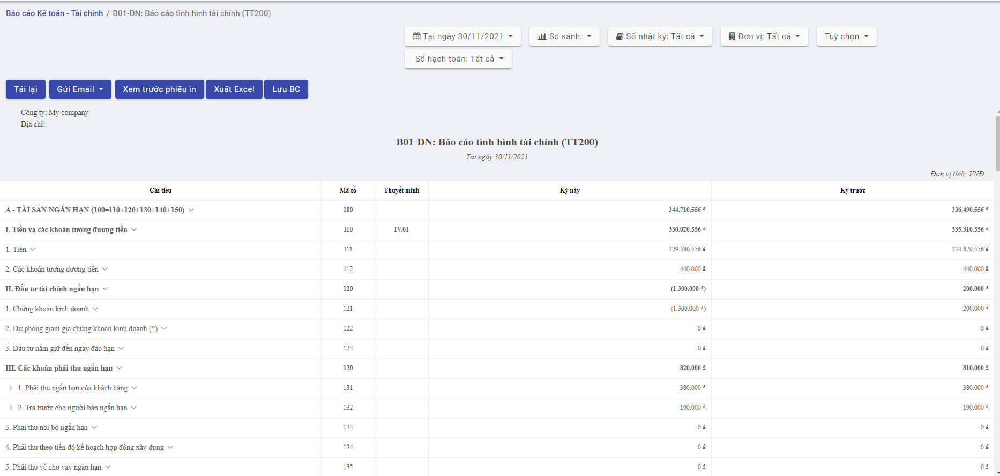

Trên **Báo cáo**, có thể thực hiện các chức năng sau:

Xem tổng quan tình hình tài chính của Doanh nghiệp thông qua các báo cáo,phiếu in như: **Báo cáo tình hình tài chính, Báo cáo kết quả hoạt động kinh doanh, Bảng cân đối tài khoản, Báo cáo lưu chuyển tiền tệ, Sổ cái tài khoản**...

- Nhấn vào biểu tượng menu **Báo cáo** màn hình hiển thị thông tin như sau: 

  

- Nhấn vào nút **Báo cáo đã lưu** để xem các báo cáo lưu chi tiết trong các thư mục

# B02-DN:Báo cáo kết quả hoạt động kinh doanh(TT200)

Chương trình cung cấp báo cáo với các tiêu chí: **Đơn vị, Từ ngày-đến ngày,So sánh kỳ, Sổ nhật ký, Sổ hạch toán, Tùy chọn lọc báo cáo gồm bút toán chưa hạch toán.**

Các chức năng thực hiện trong báo cáo gồm:

- **Tải lại**.chi tiết  [**tại đây**](##Tải lại)
- **Gửi Email** chi tiết [**tại đây**](##Gửi Email)
- **Xem trước phiếu in **chi tiết [**tại đây**](##Xem trước phiếu in)
- **Xuất Excel**chi tiết [**tại đây**](##Xuất Excel)
- **Lưu BC **chi tiết [**tại đây**](##Lưu báo cáo)

## Tải lại

### Các bước thực hiện

<u>Bước 1</u>: Vào màn hình **Báo cáo kết quả hoạt động kinh doanh(TT200)**. Chọn các tiêu chí báo cáo. Báo cáo hiển thị dữ liệu các chỉ tiêu theo tiêu chí tìm kiếm.

**Bước 2**: Bấm nút **Tải lại** để thực hiện tải lại trang báo cáo. Nếu có dữ liệu cáo cáo thay đổi. Hệ thống thực hiện cập nhật dữ liệu mới nhất vào các chỉ tiêu báo cáo.

## Gửi Email

### Các bước thực hiện

#### Gửi file Excel

<u>Bước 1</u>: Vào màn hình **Báo cáo kết quả hoạt động kinh doanh(TT200)**. Chọn các tiêu chí báo cáo. Báo cáo hiển thị dữ liệu các chỉ tiêu theo tiêu chí tìm kiếm.

<u>Bước 2:</u> Chọn **Gửi Email**. Hệ thống hiển thị 2 chức năng: **Gửi File Excel** và **Gửi File PDF** như hình:

<u>Bước 3:</u> bấm **Gửi file Excel** để thực hiện gửi Email với file Excel.Hệ thống hiển thị màn hình thông tin như sau:

<u>Bước 4</u>: Nhập dữ liệu và nhấn **Gửi ngay**.Hệ thống thực hiện gửi Email với file đính kèm là file báo cáo ở dạng file Excel.

#### Gửi file PDF

<u>Bước 1</u>: Vào màn hình **Báo cáo kết quả hoạt động kinh doanh(TT200)**. Chọn các tiêu chí báo cáo. Báo cáo hiển thị dữ liệu các chỉ tiêu theo tiêu chí tìm kiếm.

<u>Bước 2:</u> Chọn **Gửi Email**. Hệ thống hiển thị 2 chức năng: **Gửi File Excel** và **Gửi File PDF** như hình:

<u>Bước 3:</u> bấm **Gửi file PDF** để thực hiện gửi Email với file PDF.Hệ thống hiển thị màn hình thông tin như sau:

<u>Bước 4:</u> Nhập dữ liệu và nhấn **Gửi ngay**.Hệ thống thực hiện gửi Email với file đính kèm là file báo cáo ở dạng file PDF

## Xem trước phiếu in

### Các bước thực hiện

<u>Bước 1:</u> Vào màn hình **Báo cáo kết quả hoạt động kinh doanh(TT200)**. Chọn các tiêu chí báo cáo. Báo cáo hiển thị dữ liệu các chỉ tiêu theo tiêu chí tìm kiếm.

<u>Bước 2</u>: bấm nút **Xem trước phiếu in**. Màn hình hiển thị báo cáo dạng phiếu in như sau:

<u>Bước 3:</u> Bấm biểu tượng Cài đặt. Chọn **Cấu hình chữ ký.**

Hệ thống hiển thị màn hình thông tin như sau:

<u>Bước 4:</u> Nhập chức **danh - đơn vị,** **tên**. Bấm **Xác nhận** để lưu chữ ký. Sau khi cấu hình chữ ký phiếu in hiển thị chữ ký ở dưới góc trái như sau:

Bước 5:**In báo cáo:** Chọn xem trước phiếu in ==> nhấn button in  ==>  Hiển thị popup in báo cáo

## Xuất Excel

### Các bước thực hiện

<u>Bước 1</u>: Vào màn hình **Báo cáo kết quả hoạt động kinh doanh(TT200)**. Chọn các tiêu chí báo cáo. Báo cáo hiển thị dữ liệu các chỉ tiêu theo tiêu chí tìm kiếm.

<u>Bước 2:</u> bấm nút **Xuất Excel**. Hệ thống thực hiện lưu file Báo cáo kết quả hoạt động kinh doanh dưới dạng file excel

## Lưu báo cáo

### Các bước thực hiện

<u>Bước 1</u>: Vào màn hình **Báo cáo kết quả hoạt động kinh doanh(TT200)**. Chọn các tiêu chí báo cáo. Báo cáo hiển thị dữ liệu các chỉ tiêu theo tiêu chí tìm kiếm.

<u>Bước 2:</u> bấm nút **Lưu báo cáo.** Màn hình hiển thị thông tin sau:

<u>Bước 3:</u>Chọn file xuất( file excel,file pdf, tất cả). Chọn thư mục lưu báo cáo. Nhập số chứng từ. Sau đó bấm **Xuất-**-> Hệ thống thực hiện Xuất báo cáo và lưu vào thư mục đã chọn. Chi tiết xem tại **Báo cáo đã lưu**

# B02-DN:Báo cáo kết quả hoạt động kinh doanh(TT133)

Chương trình cung cấp báo cáo với các tiêu chí: **Đơn vị, Từ ngày-đến ngày,So sánh kỳ, Sổ nhật ký, Sổ hạch toán, Tùy chọn lọc báo cáo gồm bút toán chưa hạch toán.**

Các chức năng thực hiện trong báo cáo gồm:

- **Tải lại**.chi tiết  [**tại đây**](##Tải lại 2)
- **Gửi Email** chi tiết [**tại đây**](##Gửi Email 2)
- **Xem trước phiếu in **chi tiết [**tại đây**](##Xem trước phiếu in 2)
- **Xuất Excel**chi tiết [**tại đây**](##Xuất Excel 2)
- **Lưu BC **chi tiết [**tại đây**](##Lưu báo cáo 2)

## Tải lại

### Các bước thực hiện

<u>Bước 1</u>: Vào màn hình **Báo cáo kết quả hoạt động kinh doanh(TT133)**. Chọn các tiêu chí báo cáo. Báo cáo hiển thị dữ liệu các chỉ tiêu theo tiêu chí tìm kiếm.

**Bước 2**: Bấm nút **Tải lại** để thực hiện tải lại trang báo cáo. Nếu có dữ liệu cáo cáo thay đổi. Hệ thống thực hiện cập nhật dữ liệu mới nhất vào các chỉ tiêu báo cáo.

## Gửi Email

### Các bước thực hiện

#### Gửi file Excel

<u>Bước 1</u>: Vào màn hình **Báo cáo kết quả hoạt động kinh doanh(TT133)**. Chọn các tiêu chí báo cáo. Báo cáo hiển thị dữ liệu các chỉ tiêu theo tiêu chí tìm kiếm.

<u>Bước 2:</u> Chọn **Gửi Email**. Hệ thống hiển thị 2 chức năng: **Gửi File Excel** và **Gửi File PDF** như hình:

<u>Bước 3:</u> bấm **Gửi file Excel** để thực hiện gửi Email với file Excel.Hệ thống hiển thị màn hình thông tin như sau:

<u>Bước 4</u>: Nhập dữ liệu và nhấn **Gửi ngay**.Hệ thống thực hiện gửi Email với file đính kèm là file báo cáo ở dạng file Excel.

#### Gửi file PDF

<u>Bước 1</u>: Vào màn hình **Báo cáo kết quả hoạt động kinh doanh(TT133)**. Chọn các tiêu chí báo cáo. Báo cáo hiển thị dữ liệu các chỉ tiêu theo tiêu chí tìm kiếm.

<u>Bước 2:</u> Chọn **Gửi Email**. Hệ thống hiển thị 2 chức năng: **Gửi File Excel** và **Gửi File PDF** như hình:

<u>Bước 3:</u> bấm **Gửi file PDF** để thực hiện gửi Email với file PDF.Hệ thống hiển thị màn hình thông tin như sau:

<u>Bước 4:</u> Nhập dữ liệu và nhấn **Gửi ngay**.Hệ thống thực hiện gửi Email với file đính kèm là file báo cáo ở dạng file PDF

## Xem trước phiếu in

### Các bước thực hiện

<u>Bước 1:</u> Vào màn hình **Báo cáo kết quả hoạt động kinh doanh(TT133)**. Chọn các tiêu chí báo cáo. Báo cáo hiển thị dữ liệu các chỉ tiêu theo tiêu chí tìm kiếm.

<u>Bước 2</u>: bấm nút **Xem trước phiếu in**. Màn hình hiển thị báo cáo dạng phiếu in như sau:

<u>Bước 3:</u> Bấm biểu tượng Cài đặt. Chọn **Cấu hình chữ ký.**

Hệ thống hiển thị màn hình thông tin như sau:

 

<u>Bước 4:</u> Nhập chức **danh - đơn vị,** **tên**. Bấm **Xác nhận** để lưu chữ ký. Sau khi cấu hình chữ ký phiếu in hiển thị chữ ký ở dưới góc trái như sau:

Bước 5:**In báo cáo:** Chọn xem trước phiếu in ==> nhấn button in  ==>  Hiển thị popup in báo cáo

## Xuất Excel

### Các bước thực hiện

<u>Bước 1</u>: Vào màn hình **Báo cáo kết quả hoạt động kinh doanh(TT133)**. Chọn các tiêu chí báo cáo. Báo cáo hiển thị dữ liệu các chỉ tiêu theo tiêu chí tìm kiếm.

<u>Bước 2:</u> bấm nút **Xuất Excel**. Hệ thống thực hiện lưu file Báo cáo kết quả hoạt động kinh doanh dưới dạng file excel

## Lưu báo cáo

### Các bước thực hiện

<u>Bước 1</u>: Vào màn hình **Báo cáo kết quả hoạt động kinh doanh(TT133)**. Chọn các tiêu chí báo cáo. Báo cáo hiển thị dữ liệu các chỉ tiêu theo tiêu chí tìm kiếm.

<u>Bước 2:</u> bấm nút **Lưu báo cáo.** Màn hình hiển thị thông tin sau:

<u>Bước 3:</u>Chọn file xuất( file excel,file pdf, tất cả). Chọn thư mục lưu báo cáo. Nhập số chứng từ. Sau đó bấm **Xuất-**-> Hệ thống thực hiện Xuất báo cáo và lưu vào thư mục đã chọn. Chi tiết xem tại **Báo cáo đã lưu**

# Bảng cân đối tài khoản(mẫu quản trị)

Chương trình cung cấp báo cáo với các tiêu chí: **Đơn vị, Từ ngày-đến ngày,So sánh kỳ, Sổ nhật ký, Sổ hạch toán, Tùy chọn lọc báo cáo gồm bút toán chưa hạch toán.**

Các chức năng thực hiện trong báo cáo gồm:

- **Tải lại**.chi tiết  [**tại đây**](##Tải lại 3)
- **Gửi Email** chi tiết [**tại đây**](##Gửi Email 3)
- **Xem trước phiếu in **chi tiết [**tại đây**](##Xem trước phiếu in 3)
- **Xuất Excel**chi tiết [**tại đây**](##Xuất Excel 3)
- **Lưu BC **chi tiết [**tại đây**](##Lưu báo cáo 3)

## Tải lại

### Các bước thực hiện

<u>Bước 1</u>: Vào màn hình **Bảng cân đối kế toán**. Chọn các tiêu chí báo cáo. Báo cáo hiển thị dữ liệu các chỉ tiêu theo tiêu chí tìm kiếm.

**Bước 2**: Bấm nút **Tải lại** để thực hiện tải lại trang báo cáo. Nếu có dữ liệu cáo cáo thay đổi. Hệ thống thực hiện cập nhật dữ liệu mới nhất vào các chỉ tiêu báo cáo.

## Gửi Email

### Các bước thực hiện

#### Gửi file Excel

<u>Bước 1</u>: Vào màn hình **Bảng cân đối kế toán**. Chọn các tiêu chí báo cáo. Báo cáo hiển thị dữ liệu các chỉ tiêu theo tiêu chí tìm kiếm.

<u>Bước 2:</u> Chọn **Gửi Email**. Hệ thống hiển thị 2 chức năng: **Gửi File Excel** và **Gửi File PDF** như hình:

<u>Bước 3:</u> bấm **Gửi file Excel** để thực hiện gửi Email với file Excel.Hệ thống hiển thị màn hình thông tin như sau:

<u>Bước 4</u>: Nhập dữ liệu và nhấn **Gửi ngay**.Hệ thống thực hiện gửi Email với file đính kèm là file báo cáo ở dạng file Excel.

#### Gửi file PDF

<u>Bước 1</u>: Vào màn hình **Bảng cân đối kế toán**. Chọn các tiêu chí báo cáo. Báo cáo hiển thị dữ liệu các chỉ tiêu theo tiêu chí tìm kiếm.

<u>Bước 2:</u> Chọn **Gửi Email**. Hệ thống hiển thị 2 chức năng: **Gửi File Excel** và **Gửi File PDF** như hình:

<u>Bước 3:</u> bấm **Gửi file PDF** để thực hiện gửi Email với file PDF.Hệ thống hiển thị màn hình thông tin như sau:

<u>Bước 4:</u> Nhập dữ liệu và nhấn **Gửi ngay**.Hệ thống thực hiện gửi Email với file đính kèm là file báo cáo ở dạng file PDF

Bước 5:**In báo cáo:** Chọn xem trước phiếu in ==> nhấn button in  ==>  Hiển thị popup in báo cáo

## Xem trước phiếu in

### Các bước thực hiện

<u>Bước 1:</u> Vào màn hình  **Bảng cân đối kế toán**. Chọn các tiêu chí báo cáo. Báo cáo hiển thị dữ liệu các chỉ tiêu theo tiêu chí tìm kiếm.

<u>Bước 2</u>: bấm nút **Xem trước phiếu in**. Màn hình hiển thị báo cáo dạng phiếu in như sau:

<u>Bước 3:</u> Bấm biểu tượng Cài đặt. Chọn **Cấu hình chữ ký.**

Hệ thống hiển thị màn hình thông tin như sau:

 

<u>Bước 4:</u> Nhập chức **danh - đơn vị,** **tên**. Bấm **Xác nhận** để lưu chữ ký. Sau khi cấu hình chữ ký phiếu in hiển thị chữ ký ở dưới góc trái như sau:

## Xuất Excel

### Các bước thực hiện

<u>Bước 1</u>: Vào màn hình **Bảng cân đối kế toán**. Chọn các tiêu chí báo cáo. Báo cáo hiển thị dữ liệu các chỉ tiêu theo tiêu chí tìm kiếm.

<u>Bước 2:</u> bấm nút **Xuất Excel**. Hệ thống thực hiện lưu file Báo cáo kết quả hoạt động kinh doanh dưới dạng file excel

## Lưu báo cáo

### Các bước thực hiện

<u>Bước 1</u>: Vào màn hình **Bảng cân đối kế toán**. Chọn các tiêu chí báo cáo. Báo cáo hiển thị dữ liệu các chỉ tiêu theo tiêu chí tìm kiếm.

<u>Bước 2:</u> bấm nút **Lưu báo cáo.** Màn hình hiển thị thông tin sau:

<u>Bước 3:</u>Chọn file xuất( file excel,file pdf, tất cả). Chọn thư mục lưu báo cáo. Nhập số chứng từ. Sau đó bấm **Xuất-**-> Hệ thống thực hiện Xuất báo cáo và lưu vào thư mục đã chọn. Chi tiết xem tại **Báo cáo đã lưu**

# Bảng cân đối tài khoản

### Mục đích

Bảng cân đối tài khoản (hay còn gọi là Bảng cân đối phát sinh) lập ra nhằm mục đích kiểm tra, đối chiếu lại số liệu được ghi lại số liệu được ghi lại trong sổ sách, chứng từ để kiểm soát tính chính xác của số liệu trước khi lập vào bảng cân đối kế toán, hay cũng như các nghiệp vụ kinh tế khác.

### Các bước thực hiện

**Bước 1**: Vào Menu **Quản lý kế toán\Báo cáo**

**Bước 2:** Chọn **Bảng cân đối tài khoản**

**Bước 3:**  Nhập thông tin vào các Tham số để lọc lên các chỉ tiêu muốn xem  trên Báo cáo:

- Đơn vị: Chọn trong danh sách đơn vị đăng nhập
- Từ ngày - đến ngày: Nhập ngày tháng
- Danh sách tài khoản: Tuỳ chọn lấy dữ liệu của tài khoản bất kỳ
- Sổ nhật ký: Chọn trong danh sách các sổ nhật ký cần xem
- Tùy chọn:  Bao gồm bút toán chưa hạch toán

**Bước 4**:  Thực hiên các chức năng trong Báo cáo:

- **Tải lại:** Tải lại dữ liệu lấy lên báo cáo tại màn hình báo cáo

- **Gửi email:** Người dùng có thể gửi báo cáo vào email với 2 định dạng file: Excel và PDF

  

  

- **Xuất excel:** Click vào button xuất excel ==> Báo cáo được xuất ra định dạng file excel

- **Lưu báo cáo:** Lưu Báo cáo vào mục tài liệu

  

  

- **Xem trước phiếu in:** xem trước báo cáo trước khi in

  

  

- **In báo cáo:** Chọn xem trước phiếu in ==> nhấn button in  ==>  Hiển thị popup in báo cáo

  

  

- **Kích tài khoản:** Hiển thị 3 giá trị: **Sổ chi tiết tài khoản, Xem bút toán, Thêm ghi chú**

  

  

- **Sổ chi tiết tài khoản:** Chuyển sang màn hình **Sổ chi tiết theo tài khoản** khi click vào chức năng Sổ chi tiết tài khoản. Tham số truyền vào: Đơn vị được chọn, Từ ngày - đến ngày được chọn, Danh sách tài khoản được chọn

  

  

- **Xem bút toán:** Chuyển sang màn hình Danh sách chi tiết Bút toán tổng hợp lên giá trị tiền

  

  

- Thêm chú thích: Hiển thị Popup để thêm chú thích cho bút toán. Sau khi Lưu, chú thích sẽ hiển thị ở dưới báo cáo theo thứ tự tăng dần

  

# B01a-DN: Báo cáo tình hình tài chính (TT133)

### Mục đích 

Bảng cân đối kế toán là một báo cáo tài chính tổng hợp dùng để phản ánh tình hình tài sản và nguồn vốn của doanh nghiệp tại 1 thời điểm nhất định (Cuối kỳ, cuối năm). Bảng cân đối kế toán được kết cấu dưới dạng bảng cân đối số dư các tài khoản kế toàn và được sắp xếp theo yêu cầu

### Các bước thực hiện

**Bước 1**: Vào Menu **Quản lý kế toán\Báo cáo**

**Bước 2:** Chọn **B01a-DN: báo cáo tình hình tài chính (TT133)**

**Bước 3:**  Nhập thông tin vào các Tham số để lọc lên các số liệu cần xem trên Báo cáo:

- Đơn vị: chọn trong danh sách đơn vị đăng nhập
- Từ ngày- đến ngày: Nhập đến ngày muốn lấy báo cáo
- Sổ nhật ký: chọn trong danh sách các sổ nhật ký cần xem
- So sánh kỳ: hiển thị dữ liệu của kỳ được so sánh với kỳ hiện tại. Người dùng nhập số kỳ muốn so sánh
- Tùy chọn: Bao gồm bút toán chưa hạch toán 

**Bước 4**:  Thực hiên các chức năng trong Báo cáo:

- **Tải lại:** Tải lại dữ liệu lấy lên báo cáo tại màn hình báo cáo

- **Gửi email:** Người dùng có thể gửi báo cáo vào email với 2 định dạng file: Excel và PDF

  

- **Xuất excel:** Click vào button xuất excel ==> Báo cáo được xuất ra định dạng file excel

- **Lưu báo cáo:** Lưu Báo cáo vào mục tài liệu

  

  

- **Xem trước phiếu in:** Xem trước báo cáo trước khi in

  

  

- **In báo cáo:** Chọn xem trước phiếu in ==> nhấn button in  ==>  Hiển thị popup in báo cáo

  

  

- **Kích chỉ tiêu:** Hiển thị 2 giá trị: **Xem bút toán, Thêm ghi chú**

  

  

- **Xem bút toán:** Chuyển sang màn hình Danh sách chi tiết Bút toán tổng hợp lên giá trị tiền

  

- **Thêm chú thích:** Hiển thị Popup để thêm chú thích cho bút toán. Sau khi Lưu, chú thích sẽ hiển thị ở dưới báo cáo

  

- **Chi tiết theo đối tượng:** Với những chỉ tiêu note chi tiết theo đối tượng thì dropdown ra giá trị chi tiết gom theo đối tượng của chỉ tiêu đó

  

# B01b-DN: Báo cáo tình hình tài chính (TT133)

### Mục đích 

Bảng cân đối kế toán là một báo cáo tài chính tổng hợp dùng để phản ánh tình hình tài sản và nguồn vốn của doanh nghiệp tại 1 thời điểm nhất định (Cuối kỳ, cuối năm). Bảng cân đối kế toán được kết cấu dưới dạng bảng cân đối số dư các tài khoản kế toàn và được sắp xếp theo yêu cầu

### Các bước thực hiện

**Bước 1**: Vào Menu **Quản lý kế toán\Báo cáo**

**Bước 2:** Chọn **B01b-DN: báo cáo tình hình tài chính (TT133)**

**Bước 3:**  Nhập thông tin vào các Tham số để lọc lên các số liệu cần xem trên Báo cáo:

- Đơn vị: chọn trong danh sách đơn vị đăng nhập
- Từ ngày- đến ngày: Nhập đến ngày muốn lấy báo cáo
- Sổ nhật ký: Chọn trong danh sách các sổ nhật ký cần xem
- So sánh kỳ: Hiển thị dữ liệu của kỳ được so sánh với kỳ hiện tại. Người dùng nhập số kỳ muốn so sánh
- Tùy chọn: Bao gồm bút toán chưa hạch toán 

**Bước 4**:  Thực hiên các chức năng trong Báo cáo:

- **Tải lại:** Tải lại dữ liệu lấy lên báo cáo tại màn hình báo cáo

- **Gửi email:** Người dùng có thể gửi báo cáo vào email với 2 định dạng file: Excel và PDF

  

- **Xuất excel:** Click vào button xuất excel ==> Báo cáo được xuất ra định dạng file excel

- **Lưu báo cáo:** Lưu Báo cáo vào mục tài liệu

  

  

- **Xem trước phiếu in:** Xem trước báo cáo trước khi in

  

  

- **In báo cáo:** Chọn xem trước phiếu in ==> nhấn button in  ==>  Hiển thị popup in báo cáo

  

  

- **Kích chỉ tiêu:** Hiển thị 2 giá trị: **Xem bút toán, Thêm ghi chú**

  

  

- **Xem bút toán:** Chuyển sang màn hình Danh sách chi tiết Bút toán tổng hợp lên giá trị tiền

  

- **Thêm chú thích:** Hiển thị Popup để thêm chú thích cho bút toán. Sau khi Lưu, chú thích sẽ hiển thị ở dưới báo cáo

  

- **Chi tiết theo đối tượng:** Với những chỉ tiêu note chi tiết theo đối tượng thì dropdown ra giá trị chi tiết gom theo đối tượng của chỉ tiêu đó

  

# B01-DN: Báo cáo tình hình tài chính (TT200)

### Mục đích 

Bảng cân đối kế toán là một báo cáo tài chính tổng hợp dùng để phản ánh tình hình tài sản và nguồn vốn của doanh nghiệp tại 1 thời điểm nhất định (Cuối kỳ, cuối năm). Bảng cân đối kế toán được kết cấu dưới dạng bảng cân đối số dư các tài khoản kế toàn và được sắp xếp theo yêu cầu

### Các bước thực hiện

**Bước 1**: Vào Menu **Quản lý kế toán\Báo cáo**

**Bước 2:** Chọn **B01-DN: báo cáo tình hình tài chính (TT200)**

**Bước 3:**  Nhập thông tin vào các Tham số để lọc lên các số liệu cần xem trên Báo cáo:

- Đơn vị: chọn trong danh sách đơn vị đăng nhập
- Từ ngày- đến ngày: Nhập đến ngày muốn lấy báo cáo
- Sổ nhật ký: Chọn trong danh sách các sổ nhật ký cần xem
- So sánh kỳ: Hiển thị dữ liệu của kỳ được so sánh với kỳ hiện tại. Người dùng nhập số kỳ muốn so sánh
- Tùy chọn: Bao gồm bút toán chưa hạch toán 

**Bước 4**:  Thực hiên các chức năng trong Báo cáo:

- **Tải lại:** Tải lại dữ liệu lấy lên báo cáo tại màn hình báo cáo

- **Gửi email:** Người dùng có thể gửi báo cáo vào email với 2 định dạng file: Excel và PDF

  

  

- **Xuất excel:** Click vào button xuất excel ==> Báo cáo được xuất ra định dạng file excel

- **Lưu báo cáo:** Lưu Báo cáo vào mục tài liệu

  

  

- **Xem trước phiếu in:** Xem trước báo cáo trước khi in

  

  

- **In báo cáo:** Chọn xem trước phiếu in ==> nhấn button in  ==>  Hiển thị popup in báo cáo

  

  

- **Kích chỉ tiêu:** Hiển thị 2 giá trị: **Xem bút toán, Thêm ghi chú**

  

  

- **Xem bút toán:** Chuyển sang màn hình Danh sách chi tiết Bút toán tổng hợp lên giá trị tiền

  

- **Thêm chú thích:** Hiển thị Popup để thêm chú thích cho bút toán. Sau khi Lưu, chú thích sẽ hiển thị ở dưới báo cáo

  

- **Chi tiết theo đối tượng:** Với những chỉ tiêu note chi tiết theo đối tượng thì dropdown ra giá trị chi tiết gom theo đối tượng của chỉ tiêu đó

  

# Báo cáo lưu chuyển tiền tệ (pp trực tiếp) TT133

## Mục đích

Thông qua Báo cáo Lưu chuyển tiền tệ, nhà quản trị có thể thấy được trong kỳ doanh nghiệp đã lấy tiền ở đâu và đã chi tiêu, sử dụng tiền vào việc gì; thấy được mối quan hệ giữa lợi nhuận và dòng tiền thuần

## Đối tượng

Kế toán tổng hợp/Kế toán trưởng

### Các bước thực hiện

**Bước 1**: Vào Phân hệ Quản lý kế toán ---> Chức năng Báo cáo

**Bước 2:** Chọn Báo cáo lưu chuyển tiền tệ (PP trực tiệp- TT133)

**Bước 3:**  Nhập thông tin vào các Tham số để lọc lên các chỉ tiêu muốn xem  trên Báo cáo:

- Đơn vị: chọn trong danh sách đơn vị đăng nhập
- Từ ngày- đến ngày: nhập ngày tháng
- Sổ nhật ký: chọn trong danh sách các sổ nhật ký cần xem
- So sánh kỳ: hiển thị dữ liệu của kỳ được so sánh với kỳ hiện tại. Người dùng nhập số kỳ muốn so sánh
- Tùy chọn: bao gồm 2 giá trị: Bao gồm bút toán chưa hạch toán và Hiển thị những chỉ tiêu chi tiết

**Bước 4**:  Thực hiên các chức năng trong Báo cáo:

- Tải lại: tải lại dữ liệu lấy lên báo cáo tại màn hình báo cáo

- Gửi email: người dùng có thể gửi báo cáo vào email với 2 định dạng file: Excel và PDF

  

- Xuất excel: kích vào button xuất excel ---> báo cáo được xuất ra định dạng file excel

- Lưu báo cáo: lưu Báo cáo vào mục tài liệu

  

- Xem trước phiếu in: xem trước báo cáo trước khi in

  

- In báo cáo: chọn Xem trước phiếu in --> In ---> hiển thị popup in báo cáo

  

- Kích chỉ tiêu: hiển thị 2 giá trị: Xem bút toán và Thêm ghi chú

- Xem bút toán: chuyển sang màn hình Danh sách chi tiết Bút toán tổng hợp lên giá trị tiền

  

- Thêm chú thích: Hiển thị Popup để thêm chú thích cho bút toán. Sau khi Lưu, chú thích sẽ hiển thị ở dưới báo cáo

# Báo cáo lưu chuyển tiền tệ (pp trực tiếp) TT200

## Mục đích 

Thông qua Báo cáo Lưu chuyển tiền tệ, nhà quản trị có thể thấy được trong kỳ doanh nghiệp đã lấy tiền ở đâu và đã chi tiêu, sử dụng tiền vào việc gì; thấy được mối quan hệ giữa lợi nhuận và dòng tiền thuần

## Đối tượng

Kế toán tổng hợp/Kế toán trưởng

### Các bước thực hiện

**Bước 1**: Vào Phân hệ Quản lý kế toán ---> Chức năng Báo cáo

**Bước 2:** Chọn Báo cáo lưu chuyển tiền tệ (PP trực tiệp- TT200)

**Bước 3:**  Nhập thông tin vào các Tham số để lọc lên các số liệu cần xem trên Báo cáo:

- Đơn vị: chọn trong danh sách đơn vị đăng nhập
- Từ ngày- đến ngày: nhập ngày tháng
- Sổ nhật ký: chọn trong danh sách các sổ nhật ký cần xem
- So sánh kỳ: hiển thị dữ liệu của kỳ được so sánh với kỳ hiện tại. Người dùng nhập số kỳ muốn so sánh
- Tùy chọn: bao gồm 2 giá trị: Bao gồm bút toán chưa hạch toán và Hiển thị những chỉ tiêu chi tiết

**Bước 4**:  Thực hiên các chức năng trong Báo cáo:

- Tải lại: tải lại dữ liệu lấy lên báo cáo tại màn hình báo cáo
- Gửi email: người dùng có thể gửi báo cáo vào email với 2 định dạng file: Excel và PDF

- Xuất excel: kích vào button xuất excel ---> báo cáo được xuất ra định dạng file excel

- Lưu báo cáo: lưu Báo cáo vào mục tài liệu

  

- Xem trước phiếu in: xem trước báo cáo trước khi in

  

- In báo cáo: chọn Xem trước phiếu in --> In ---> hiển thị popup in báo cáo

  

- Kích chỉ tiêu: hiển thị 2 giá trị: Xem bút toán và Thêm ghi chú

- Xem bút toán: chuyển sang màn hình Danh sách chi tiết Bút toán tổng hợp lên giá trị tiền

  

- Thêm chú thích: Hiển thị Popup để thêm chú thích cho bút toán. Sau khi Lưu, chú thích sẽ hiển thị ở dưới báo cáo

