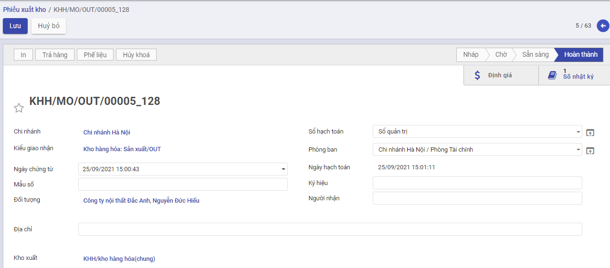

# *Quy trình nghiệp vụ*

## **Quy trình nghiệp vụ**

Kế toán kho chịu trách nhiệm chính  trong việc lập hóa đơn chứng từ và theo dõi chi tiết hàng hóa trong kho, bao gồm cả tình hình hàng nhập – xuất – tồn; đối chiếu các hóa đơn, chứng từ sổ sách với số liệu thực tế do Thủ kho trình lên, giúp hạn chế tối đa những rủi ro, thất thoát cho doanh nghiệp.

Kế toán kho thực hiện quản lý tình hình nhập, xuất, tồn kho theo chủng loại, nhóm, chi tiết vật tư, hàng hóa, thành phẩm. Ngoài ra có  quản lý chi tiết đến từng kho, hỗ trợ tự động xuất kho theo cách thức xuất kho Nhập trước xuất trước (FIFO),  Nhập sau xuất trước (LIFO) , thực hiện hỗ trợ tự động tính giá xuất kho theo 4 phương pháp: Bình quân tức thời, Bình quân cuối kỳ, Đích danh, Nhập trước xuât trước  và lên các báo cáo kho: Tồn kho, Nhập xuất tồn kho

## **Các luồng quy trình**

·     Lập Lệnh sản xuất. Chi tiết nghiệp vụ **tại đây**

·     Lập phiếu nhập kho hàng hóa, thành phẩm. Chi tiết nghiệp vụ **tại đây**

·     Lập phiếu xuất kho hàng hóa, thành phẩm. Chi tiết nghiệp vụ **tại đây**

·     Lập phiếu điều chuyển kho hàng hóa, thành phẩm. Chi tiết nghiệp vụ **tại đây**

·     Lắp ráp/Tháo dỡ. Chi tiết nghiệp vụ **tại đây**

·     Kiểm kê kho . Chi tiết nghiệp vụ **tại đây**

·     Tính giá xuất kho. Chi tiết nghiệp vụ **tại đây**

# *Lập lệnh sản xuất*

## Mô tả nghiệp vụ

Căn cứ vào đơn đặt hàng bán đã duyệt, bộ phận kế hoạch hoặc kế toán thực hiện Lập lệnh sản xuất theo số lượng thành phẩm đã được duyệt tại đơn đặt hàng bán

Đồng thời xác định vật tư chính, phụ cần để sản xuất ra số lượng thành phẩm theo lệnh sản xuất

**Xem video hướng dẫn**

*[Xây dựng video hướng dẫn trên phần mềm, gồm đủ các luồng chức năng được mô tả bên dưới]*

## Lập lệnh sản xuất

Đối tượng thực hiện: Kế toán kho, nhân viên bộ phận kế hoạch

Bước 1: Vào phân hệ **Kho vận**, Chọn nhóm **Hoạt động** , chọn chức năng **Lệnh sản xuất** (Hoặc thực hiện **Tìm kiếm** trực tiếp chức năng trên ô tìm kiếm chung của hệ thống)

Bước 2: Người dùng nhập các thông tin trên tab chung

- **Định mức vật tư**: 
- Trường hợp Thành phẩm cần sản xuất chưa có Định mức NVL thì cần tạo định mức trước: Vào phân hệ **Kho Vận** chọn chức năng **Định mức nguyên vật liệu (BOM)**, điền các thông tin về Thành phẩm cần sản xuất, NVL cần thiết để tạo ra số lượng Thành phẩm nhất định.

- Trường hợp Thành phẩm cần sản xuất đã có Định mức NVL: Khi nhập Số lượng và Định mức NVL thì hệ thống sẽ tự động đẩy dữ liệu xuống tab **Nguyên vật liệu** như hình:

Bước 3: Người dùng thực hiện lần lượt các thao tác nhấn **Xác nhận**, **Kiểm tra tính khả dụng** (kiểm tra trong kho còn đủ NVL để sản xuất không), **Đánh dấu hoàn tất**. Như vậy Lệnh sản xuất đã được **Hoàn thành**.

- **Lưu ý:** Sau khi Lệnh sản xuất hoàn thành hệ thống tự động sinh Phiếu nhập kho (thành phẩm) và Phiếu xuất kho (NVL).

- Cấu hình **Kiểu hoạt động** dùng cho sản xuất:

  - **Loại hoạt động**: Sản xuất
  - **Địa điểm đích mặc định, Địa điểm đi mặc định**: Kho của công ty

  

- Cấu hình **Loại hoạt động xuất**:
  - Trường **movement type**: Chọn Xuất sản xuất
  - **Địa điểm đi mặc định**: Kho công ty
  - **Địa điểm đích mặc định**: Kho ảo sản xuất

- Cấu hình **Loại hoạt động nhập**:
  - Trường **movement type**: Chọn Nhập thành phẩm sản xuất
  - **Điểm đi mặc định**: Kho ảo sản xuất
  - **ĐIểm đích mặc định**: Kho công ty

# *Lập phiếu nhập kho*

## Mô tả nghiệp vụ

Đối với các đơn vị sản xuất sản phẩm hàng loạt hoặc theo đơn đặt hàng... sau khi sản phẩm hoàn thành thì sẽ chuyển về nhập kho. Khi đó, Kế toán sẽ thực hiện các bước sau:

- Căn cứ và phiếu báo số lượng thành phẩm hoàn thành nhập kho của bộ phận sản xuất, Kế toán kho lập Phiếu nhập kho thành phẩm.
- Kế toán trưởng và Giám đốc ký duyệt.
- Căn cứ vào phiếu nhập kho, Thủ kho kiểm tra, nhận hàng và tiến hành nhập kho, người bàn giao và Thủ kho ký vào phiếu nhập kho.
- Thủ kho ghi sổ kho, chuyển 1 liên phiếu nhập kho cho Kế toán ghi sổ kế toán kho.

**Xem video hướng dẫn**

*[Xây dựng video hướng dẫn trên phần mềm, gồm đủ các luồng chức năng được mô tả bên dưới]*

## Lập phiếu nhập kho

Căn cứ vào đơn mua hàng, hóa đơn mua hàng, phiếu xuất kho bên bán, và thực tế hàng về, kế toán kho thực hiện Lập phiếu nhập kho (vật tư) tương ứng

Đối tượng thực hiện: Kế toán kho

Bước 1: Vào phân hệ **Kho vận**, Chọn nhóm **Hoạt động** , chọn chức năng **Phiếu nhập kho** (Hoặc thực hiện **Tìm kiếm** trực tiếp chức năng trên ô tìm kiếm chung của hệ thống)

Bước 2: Người dùng nhập các thông tin ở tab chung. Lưu ý: Trường **Loại nhập** khi lựa chọn thì phải có Địa điểm đích mặc định chính là kho cần nhập hàng hóa, thành phẩm và được tự động đẩy xuống trường **Kho nhập** (Ở tab chung và tab VTHH). Tùy các trường hợp nhập kho khác nhau mà chọn Loại nhập và có Kho nhập khác nhau. Cụ thể:

- Nhập kho mua hàng hóa, vật tư
- Nhập kho thành phẩm
- Nhập kho hàng bán bị trả lại
- Nhập kho từ chi nhánh chuyển đến

Bước 3: 

- Trường hợp nhập kho mua hàng hóa, vật tư theo đơn hàng. Người dùng có thể tích vào trường **Chọn đơn mua hàng** (Có thể chọn cùng lúc nhiều đơn mua hàng) hệ thống sẽ tự động đẩy thông tin xuống tab **Vật tư hàng hóa (VTHH)** như hình dưới:

- Trường hợp khác, người dùng tự nhập tay các thông tin ở Tab VTHH.

Bước 4: Người dùng thao tác nhấn **Lưu**, nhấn **Đánh dấu cần làm:**

- Thực hiện nhập kho theo Nhu cầu thực tế.

- Nếu Số lượng nhập kho (Hoàn thành) đủ theo nhu cầu: Thực hiện nhấn **Xác nhận**.

- Nếu Số lượng nhập kho Chưa đủ theo Số lượng nhu cầu: Thực hiện nhập số lượng theo thực tế. Khi đó có 2 hướng thực hiện :

  - Nếu chọn **Tạo phần dở dang**: Với Số lượng còn thiếu, hệ thống tạo sẵn 1 chứng từ Phiếu nhập kho, để Khi nhập kho với Số lượng còn lại, bộ phận Kho tiếp tục vào Phiếu nhập kho (đã tạo phần dở dang) để thực hiện Xác nhận Số lượng nhập kho còn lại.
  - Nếu chọn **Không tạo phần dở dang**: Khi đó hệ thống Tách Số lượng nhu cầu ban đầu Bằng đúng Số lượng thực nhận, còn Số lượng chênh chưa nhận được thì Số lượng hoàn thành = 0

  Như vậy **Phiếu nhập kho** đã **Hoàn thành** .

 Đồng thời sinh bút toán ở tab **Hạch toán**.

# *Lập phiếu xuất kho*

## Mô tả nghiệp vụ

Khi phát sinh nghiệp vụ xuất nguyên vật liệu dùng cho sản xuất, thông thường sẽ phát sinh các hoạt động sau:

- Căn cứ vào kế hoạch sản xuất hoặc đơn hàng của khách hàng trong kỳ, trưởng bộ phận sản xuất sẽ lập lệnh sản xuất cho các phân xưởng
- Căn cứ vào lệnh sản xuất kế toán kho hoặc người chịu trách nhiệm sẽ đề nghị xuất nguyên vật liệu dùng cho sản xuất
- Kế toán kho lập Phiếu xuất kho, sau đó chuyển Kế toán trưởng và Giám đốc ký duyệt
- Căn cứ vào Phiếu xuất kho, Thủ kho xuất kho hàng hoá
- Thủ kho ghi sổ kho, còn kế toán ghi sổ kế toán kho.

**Xem video hướng dẫn**

*[Xây dựng video hướng dẫn trên phần mềm, gồm đủ các luồng chức năng được mô tả bên dưới]*

## Lập phiếu xuất kho

Đối tượng thực hiện: Kế toán kho

Bước 1: Vào phân hệ **Kho vận**, Chọn nhóm **Hoạt động** , chọn chức năng **Phiếu xuất kho** (Hoặc thực hiện **Tìm kiếm** trực tiếp chức năng trên ô tìm kiếm chung của hệ thống)

Bước 2: Người dùng nhập các thông tin ở tab chung. Lưu ý: Lựa chọn **Kiểu giao nhận** có Địa điểm đi mặc định chính là kho cần xuất vật tư, hàng hóa và được tự động đẩy xuống trường **Kho xuất** (ở tab chung và tab VTHH). Tùy các trường hợp xuất kho mà lựa chọn các **Loại nhập** và **Kho xuất** khác nhau. Cụ thể:

- Xuất kho NVL dùng cho sản xuất
- Xuất kho hàng bán
- Xuất kho hàng mua trả lại
- Xuất kho cho các công ty/chi nhánh

Bước 3: 

- Trường hợp xuất kho theo đơn hàng bán, người dùng có thể tích vào trường **Chọn đơn hàng bán** (có thể cùng lúc chọn nhiều đơn hàng bán), hệ thống sẽ tự động đẩy thông tin xuống tab **Vật tư hàng hóa (VTHH)** như hình:

- Trường hợp khác, người dùng tự nhập tay các thông tin ở tab VTHH.

Bước 4: Người dùng thao tác nhấn **Lưu**, **Đánh dấu cần làm**, **Kiểm tra tính khả dụng** (kiểm tra trong kho có đủ số lượng hàng hóa để xuất không):

- Thực hiện xuất kho theo Nhu cầu thực tế.

- Nếu Số lượng xuất kho (Hoàn thành) đủ theo nhu cầu: Thực hiện nhấn **Xác nhận**.

- Nếu Số lượng xuất kho Chưa đủ theo Số lượng nhu cầu: Thực hiện xuất số lượng theo thực tế. Khi đó có 2 hướng thực hiện :

  - Nếu chọn **Tạo phần dở dang**: Với Số lượng còn thiếu, hệ thống tạo sẵn 1 chứng từ Phiếu xuất kho, để Khi nhập kho với Số lượng còn lại, bộ phận Kho tiếp tục vào Phiếu xuất kho (đã tạo phần dở dang) để thực hiện Xác nhận Số lượng xuất kho còn lại.
  - Nếu chọn **Không tạo phần dở dang**: Khi đó hệ thống Tách Số lượng nhu cầu ban đầu Bằng đúng Số lượng thực xuất, còn Số lượng chênh chưa nhận được thì Số lượng hoàn thành = 0

  Như vậy **Phiếu xuất kho** đã **Hoàn thành** .

 Đồng thời sinh bút toán ở tab **Hạch toán** (tương tự **Phiếu nhập kho**)

## **Xuất kho cho công ty/chi nhánh**

### **Mô tả nghiệp vụ**

Khi có yêu cầu xuất hàng cho các công ty/chi nhánh, thông thường sẽ phát sinh các hoạt động sau:

Căn cứ vào lệnh điều động nội bộ của công ty về việc chuyển hàng cho các công ty/chi nhánh bộ phận chịu trách nhiệm sẽ lập đề nghị xuất kho hàng hóa:

- Kế toán kho lập Phiếu xuất kho, sau đó chuyển Kế toán trưởng và Giám đốc ký duyệt
- Căn cứ vào Phiếu xuất kho, Thủ kho xuất kho hàng hoá
- Thủ kho ghi sổ kho, còn kế toán ghi sổ kế toán kho.
- Bộ phận đề xuất nhận hàng, sau đó vận chuyển tới các công ty/chi nhánh

**Lập phiếu xuất kho cho công ty/chi nhánh**

Tương tự như **Lập phiếu xuất kho** đã trình bày ở trên, tuy nhiên cần chú ý:

- Cấu hình **Kiểu giao nhận (Loại xuất)** :
  - **Movement type:** Chọn Xuất công ty/chi nhánh (sinh phiếu nội bộ) và Value là T-
  - **Điểm đi mặc định:** Kho của công ty

- Người dùng nhập thông tin ở tab chung cần lưu ý:

  - Người dùng lựa chọn **Loại xuất (Kiểu hoạt động)** - Xuất cho công ty/chi nhánh, hệ thống sẽ tự động cập nhập **Kho xuất** theo **Loại xuất** đã chọn.
  - Ngoài ra, người dùng lựa chọn **Chi nhánh nhận** và **Kiểu hoạt động (Loại nhập)** - Nhập cho công ty/chi nhánh thuộc chi nhánh đó, hệ thống sẽ tự động cập nhật **Kho nhập** theo **Loại nhập** đã chọn.

  Sau khi hoàn thành **Phiếu xuất kho**, hệ thống sẽ tự động sinh **Phiếu nhập kho** (trạng thái Nháp). Và phiếu nhập kho sẽ có cấu hình **Kiểu giao nhận (Loại nhập)** như sau:
  
  - **Movement type**: Chọn Nhập từ công ty/chi nhánh và có Value T+
  - **Điểm đích mặc định:** Kho của công ty

# *Lập phiếu chuyển kho*

## Mô tả nghiệp vụ

Khi phát sinh nhu cầu vận chuyển hàng hóa giữa các kho nội bộ trong doanh nghiệp, thông thường sẽ phát sinh các hoạt động sau:

- Căn cứ vào tình hình tồn kho của các mặt hàng trong kho, Giám đốc sẽ có lệnh điều chuyển hàng giữa các kho trong doanh nghiệp
- Kế toán kho lập Phiếu xuất kho, sau đó chuyển Kế toán trưởng và Giám đốc ký duyệt
- Căn cứ vào Phiếu xuất kho, Thủ kho xuất kho hàng hoá
- Thủ kho ghi sổ kho, còn kế toán ghi sổ kế toán kho.
- Bộ phận chịu trách nhiệm vận chuyển nhận hàng, sau đó chuyển tới kho cần nhập hàng

**Xem video hướng dẫn**

*[Xây dựng video hướng dẫn trên phần mềm, gồm đủ các luồng chức năng được mô tả bên dưới]*

## Lập phiếu chuyển kho

Đối tượng thực hiện: Kế toán kho

Bước 1: Vào phân hệ **Kho vận**, Chọn nhóm **Hoạt động** , chọn chức năng **Phiếu chuyển kho** (Hoặc thực hiện **Tìm kiếm** trực tiếp chức năng trên ô tìm kiếm chung của hệ thống)

Bước 2: Người dùng nhập vào tab chung. Trong đó: 

- Trường **Loại chuyển**: Chọn cấu hình **Điều chuyển nội bộ**:
  - Loại hoạt động: Chọn Giao dịch nội bộ
  - Địa điểm đi mặc định, địa điểm đích mặc định: lựa chọn phụ thuộc vào việc điều chuyển nội bộ giữa các kho nào (từ kho nào đến kho nào)

Bước 3: Nhập các thông tin về Sản phẩm , số lượng cần điều chuyển ở tab **VTHH**.

Bước 4: Nhấn **Lưu**, **Đánh dấu cần làm**, **Kiểm tra tính khả dụng** (Kiểm tra ở kho xuất có đủ lượng hàng để xuất không), nhấn **Xác nhận**, như vậy **Phiếu điều chuyển** đã hoàn thành.

Đồng thời, sinh hạch toán ở tab **Hạch toán.**

# *Lắp ráp, tháo dỡ*

## Mô tả nghiệp vụ tháo dỡ

Khi có yêu cầu xuất kho vật tư hàng hóa để tháo dỡ thành thành phẩm, thông thường sẽ phát sinh các hoạt động sau:

- Tùy thuộc vào nhu cầu hàng hóa để bán hàng, trưởng bộ phận bán hàng hoặc bộ phận kho lập lệnh tháo dỡ hàng hóa
- Căn cứ vào lệnh tháo dỡ kế toán kho hoặc người chịu trách nhiệm sẽ viết phiếu xuất kho hàng hóa mang đi tháo dỡ
- Căn cứ vào Phiếu xuất kho, Thủ kho xuất kho hàng hoá
- Thủ kho ghi sổ kho, còn kế toán ghi sổ kế toán kho.
- Bộ phận đề xuất nhận hàng để mang đi tháo dỡ
- Sau khi tháo dỡ hàng hóa, bộ phận tháo dỡ yêu cầu nhập kho thành phẩm tháo dỡ
- Kế toán kho lập Phiếu nhập kho, sau đó chuyển Kế toán trưởng và Giám đốc ký duyệt
- Căn cứ vào phiếu nhập kho, thủ kho kiểm, nhận thành phẩm và ký vào phiếu nhập kho.
- Thủ kho ghi sổ kho, còn kế toán ghi sổ kế toán kho.

## Mô tả nghiệp vụ lắp ráp

Khi có yêu cầu xuất kho vật tư hàng hóa để lắp ráp thành thành phẩm, thông thường sẽ phát sinh các hoạt động sau:

- Căn cứ vào đơn hàng của khách hàng, trưởng bộ phận bán hàng hoặc bộ phận kho lập lệnh lắp ráp
- Căn cứ vào lệnh lắp ráp kế toán kho hoặc người chịu trách nhiệm sẽ viết phiếu xuất kho linh kiện mang đi lắp ráp
- Kế toán trưởng và Giám đốc ký duyệt
- Căn cứ vào Phiếu xuất kho, Thủ kho xuất kho hàng hoá
- Thủ kho ghi sổ kho, còn kế toán ghi sổ kế toán kho.
- Bộ phận đề xuất nhận hàng để mang đi lắp ráp
- Sau khi lắp ráp thành phẩm xong, bộ phận lắp ráp đề nghị nhập kho thành phẩm
- Kế toán kho lập Phiếu nhập kho, sau đó chuyển Kế toán trưởng và Giám đốc ký duyệt
- Căn cứ vào phiếu nhập kho, thủ kho kiểm, nhận thành phẩm và ký vào phiếu nhập kho.
- Thủ kho ghi sổ kho, còn kế toán ghi sổ kế toán kho.

**Xem video hướng dẫn**

*[Xây dựng video hướng dẫn trên phần mềm, gồm đủ các luồng chức năng được mô tả bên dưới]*

## Lập lệnh Lắp ráp, tháo dỡ

Bước 1: Vào phân hệ **Kho vận**, Chọn nhóm **Hoạt động** , chọn chức năng **Lệnh lắp ráp, tháo dỡ** (Hoặc thực hiện **Tìm kiếm** trực tiếp chức năng trên ô tìm kiếm chung của hệ thống)

Bước 2: Nhập các thông tin vào tab chung, trong đó:

- **Loại**: Chọn Tháo dỡ hoặc Lắp ráp.
  - Tháo dỡ: Sau khi chọn **Sản phẩm** cần tháo dỡ, **Số lượng** cần tháo dỡ, ngoài **Định mức vật tư**, người dùng có thể chọn **Lệnh sản xuất** (để tháo dỡ sản phẩm dựa vào Lệnh sản xuất).
  - Lắp ráp: Sau khi chọn **Sản phẩm** cần tháo dỡ, **Số lượng** cần tháo dỡ, hệ thống căn cứ vào sản phẩm cần tháo dỡ sẽ đưa ra **Định mức vật tư** tương ứng.
- **Kiểu hoạt động, Loại hoạt động xuất, Loại hoạt động nhập**: tương tự như Lệnh sản xuất (như hình)

Bước 3: Nhấn **Lưu.**

-  Nhấn **Tháo dỡ** (trường hợp Lệnh tháo dỡ), lúc này Lệnh tháo dỡ được **Hoàn thành**. Khi đó hệ thống sẽ tự động sinh:

  - Phiếu xuất kho: Phiếu xuất kho thành phẩm cần mang đi tháo dỡ.
  - Phiếu nhập kho: Phiếu nhập kho các NVL sau khi đã tháo dỡ từ thành phẩm.

- Nhấn **Lắp ráp** (Trường hợp Lệnh lắp ráp), lúc này Lệnh lắp ráp được **Hoàn thành.** Khi đó hệ thống sẽ tự động sinh:

  - Phiếu xuất kho: Phiếu xuất kho NVL cần mang đi lắp ráp.
  - Phiếu nhập kho: Phiếu nhập kho thành phẩm sau khi đã lắp ráp.

   

# *Phân bổ phụ phí*

## Mô tả nghiệp vụ

Cho phép nhân viên kế toán, thủ kho thực hiện phân bổ phụ phí vào giá vốn hàng nhập kho

**Xem video hướng dẫn**

*[Xây dựng video hướng dẫn trên phần mềm, gồm đủ các luồng chức năng được mô tả bên dưới]*

## Phân bổ phụ phí

Bước 1: Vào phân hệ **Kho vận**, Chọn nhóm **Hoạt động** , chọn chức năng **Phân bổ phụ phí** (Hoặc thực hiện **Tìm kiếm** trực tiếp chức năng trên ô tìm kiếm chung của hệ thống)

Bước 2: Người dùng nhập các thông tin ở tab chung, cụ thể:

- Áp dụng cho: Hệ thống đang để mặc định là **Điều chuyển hàng**, mục đích người dùng cần phân bổ phụ phí theo Phiếu nhập kho hay Lệnh sản xuất thì lựa chọn.

- Điều chuyển hàng : Người dùng lựa chọn phiếu nhập kho cần phân bổ chi phí. Hệ thống sẽ tự động đẩy thông tin chi tiết sản phẩm xuống tab chi tiết nhập kho.

- Công nợ nhà cung cấp: 

  - Chọn hóa đơn phụ phí: Hệ thống sẽ tự động đẩy thông tin phụ phí xuống tab chi tiết phụ phí. Trường hợp không phân bổ phụ phí cho tất cả các sản phẩm có trong phiếu nhập kho, người dùng có thể tích chọn ở cột Có phân bổ.
  - Người dùng có thể nhập trực tiếp thông tin phụ phí ở tab chi tiết phụ phí mà không cần chọn **Công nợ nhà cung cấp.**

  

Bước 3: Người dùng tích vào **Tính toán** (ở góc cuối bên phải tab chi tiết phụ phí), kết quả sẽ được hiển thị ở tab chi tiết phân bổ.

Bước 4: Người dùng nhấn **Xác nhận**, khi đó bản ghi sẽ được **Ghi vào sổ.**

# *Kiểm kê hàng tồn kho*

## Mô tả nghiệp vụ

Khi có yêu cầu kiểm kê kho từ kế toán trưởng hoặc Ban lãnh đạo công ty, bộ phận kế toán sẽ phát sinh một số hoạt động sau:

- Thành lập ban kiểm kê gồm: Kế toán kho, Thủ kho, Kế toán trưởng hoặc Giám đốc.
- Kiểm kê hàng hóa thực tế trong từng kho, đối chiếu số dư thực tế kiểm kê với sổ kế toán kho
- Nếu có chênh lệch thì tiến hành tìm nguyên nhân xử lý
- Trưởng ban kiểm kê sẽ đưa ra quyết định xử lý
- Căn cứ và quyết định xử lý, Kế toán kho thực hiện lập phiếu nhập kho, hoặc phiếu xuất kho. Đồng thời, hạch toán bút toán chênh lệch thừa, thiếu hàng hóa so với sổ kế toán.
- Trường hợp tìm được nguyên nhân và yêu cầu bồi thường thì hạch toán phải thu hoặc phải trả cho đối tượng phải bồi thường. Trường hợp chưa tìm được nguyên nhân thì hạch toán vào tài sản thừa chờ xử lý hoặc tài sản thiếu chờ xử lý 

**Xem video hướng dẫn**

*[Xây dựng video hướng dẫn trên phần mềm, gồm đủ các luồng chức năng được mô tả bên dưới]*

## Kiểm kê kho

Bước 1: Vào phân hệ **Kho vận**, Chọn nhóm **Hoạt động** , chọn chức năng **Kiểm kê kho** (Hoặc thực hiện **Tìm kiếm** trực tiếp chức năng trên ô tìm kiếm chung của hệ thống)

Bước 2: Sau khi người dùng nhập các thông tin vào tab chung, nhấn **Bắt đầu kiểm kho**. Người dùng nhập các thông tin ở tab Kiểm kho, điền số lượng đã kiểm đếm được ở cột **Đã đếm**.

- Nhập thông tin thành viên tham gia kiểm đếm ở tab thành viên tham gia.

Bước 3: Nhấn **Xác nhận kiểm kho** , khi đó phiếu kiểm kê đã được **Hoàn thành.** Khi đó hệ thống tự động cập nhật kho theo số lượng kiểm đếm.

# *Tính giá xuất kho*

## Mô tả nghiệp vụ

Thực hiện tính và cập nhật giá xuất kho vào các phiếu xuất kho trong kỳ, căn cứ vào phương pháp tính giá xuất kho đã được xác định trên **Kho vận\Cấu hình\Nhóm sản phẩm**

**Xem video hướng dẫn**

*[Xây dựng video hướng dẫn trên phần mềm, gồm đủ các luồng chức năng được mô tả bên dưới]*

## Tính giá xuất kho

Đối tượng thực hiện: Kế toán kho

Bước 1: Vào phân hệ **Kho vận**, Chọn nhóm **Hoạt động** , chọn chức năng **Tính giá xuất kho** (Hoặc thực hiện **Tìm kiếm** trực tiếp chức năng trên ô tìm kiếm chung của hệ thống)

Nhập thông tin để tính giá xuất kho: Vật tư hàng hóa cần tính giá, thời gian, kho nhập, kho xuất, kỳ tính giá

Với phương pháp bình quân cuối kỳ: 

·     Tích chọn **Tính theo kho**, giá xuất của vật tư hàng hoá sẽ được tự động tính bình quân trên từng kho.

·     Tích chọn **Tính giá không theo kho**, giá xuất của vật tư hàng hoá sẽ được tự động tính bình quân trên tất cả các kho.

Nhấn **Lưu**

Với phương pháp bình quân tức thời:

·     Tích chọn **Tính theo kho**, giá xuất của vật tư hàng hoá sẽ được tự động tính bình quân tức thời trên từng kho.

·     Tích chọn **Tính giá không theo kho**, giá xuất của vật tư hàng hoá sẽ được tự động tính bình quân tức thời trên tất cả các kho.

Nhấn **Lưu**

Với phương pháp tính giá đích danh:

·     Tích chọn **Tính theo kho**, giá xuất của vật tư hàng hoá sẽ được tự động tính theo phương pháp đích danh trên từng kho.

·     Tích chọn **Tính giá không theo kho**, giá xuất của vật tư hàng hoá sẽ được tự động tính theo phương pháp đích danh trên tất cả các kho.

Nhấn **Lưu**

Với phương pháp tính giá nhập trước xuất trước:

·     Tích chọn **Tính theo kho**, giá xuất của vật tư hàng hoá sẽ được tự động tính theo phương pháp nhập trước xuất trước trên từng kho.

·     Tích chọn **Tính giá không theo kho**, giá xuất của vật tư hàng hoá sẽ được tự động tính theo phương phápnhập trước xuất trước trên tất cả các kho.

Nhấn **Lưu**

Lưu ý: Trường hợp muốn tính giá xuất kho cho một hoặc một số vật tư hàng hoá, thực hiện như sau:

- Tích **Chọn vật tư, hàng hóa** khi thực hiện tính giá xuất kho.
- Nhấn vào biểu tượng : Chọn.. (như hình)

- Tích chọn các vật tư hàng hoá cần tính lại giá xuất kho, nhấn **Đồng ý**
